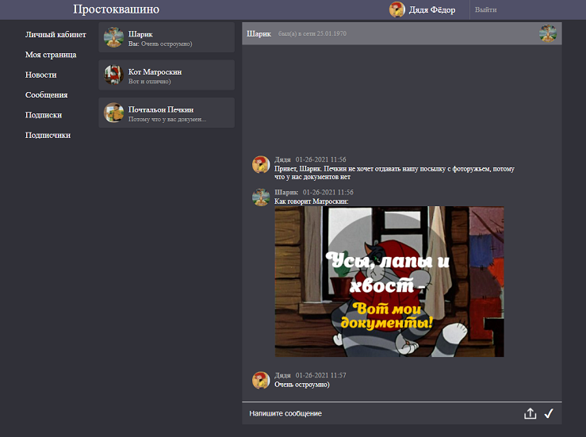
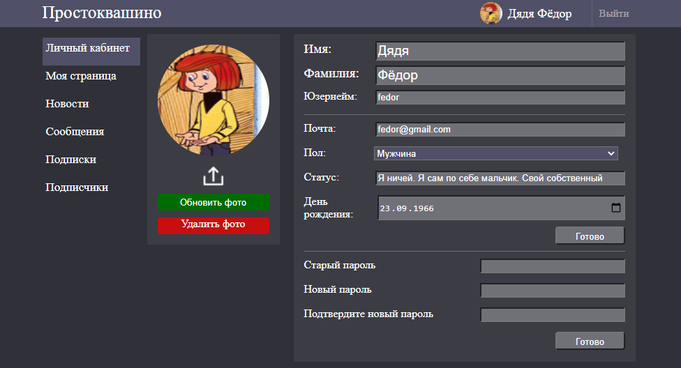
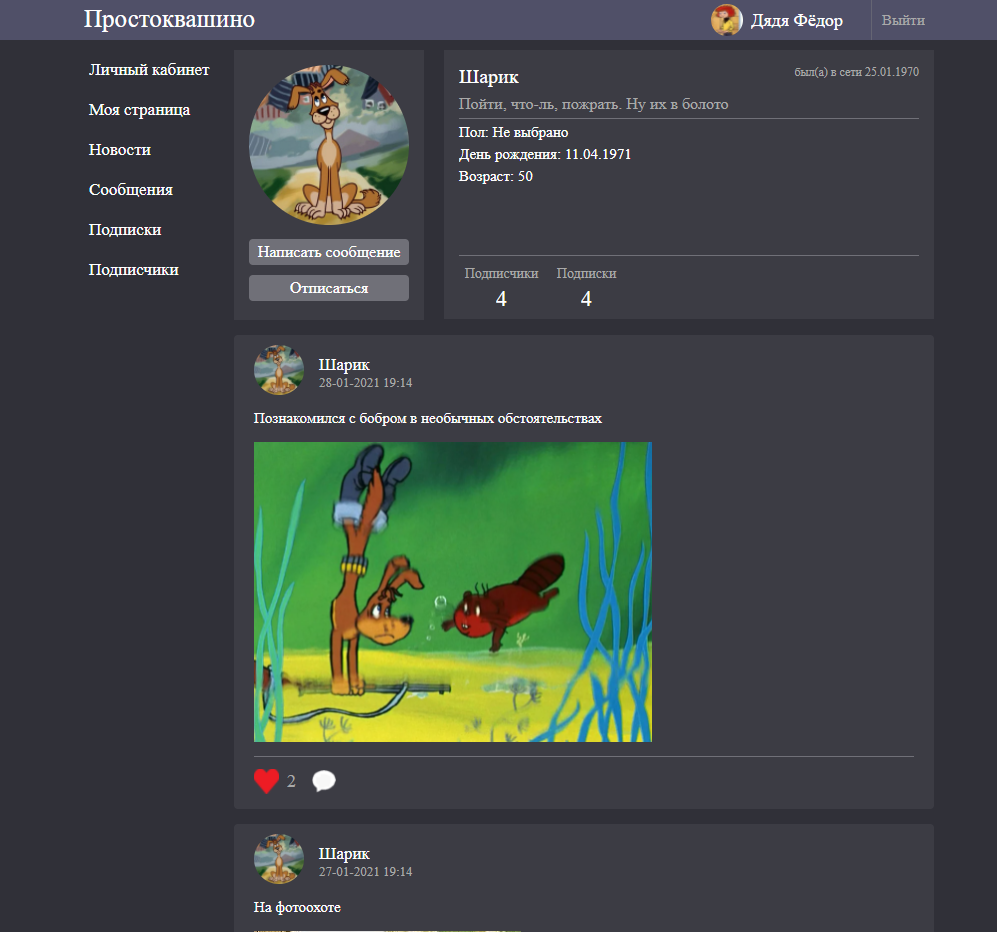
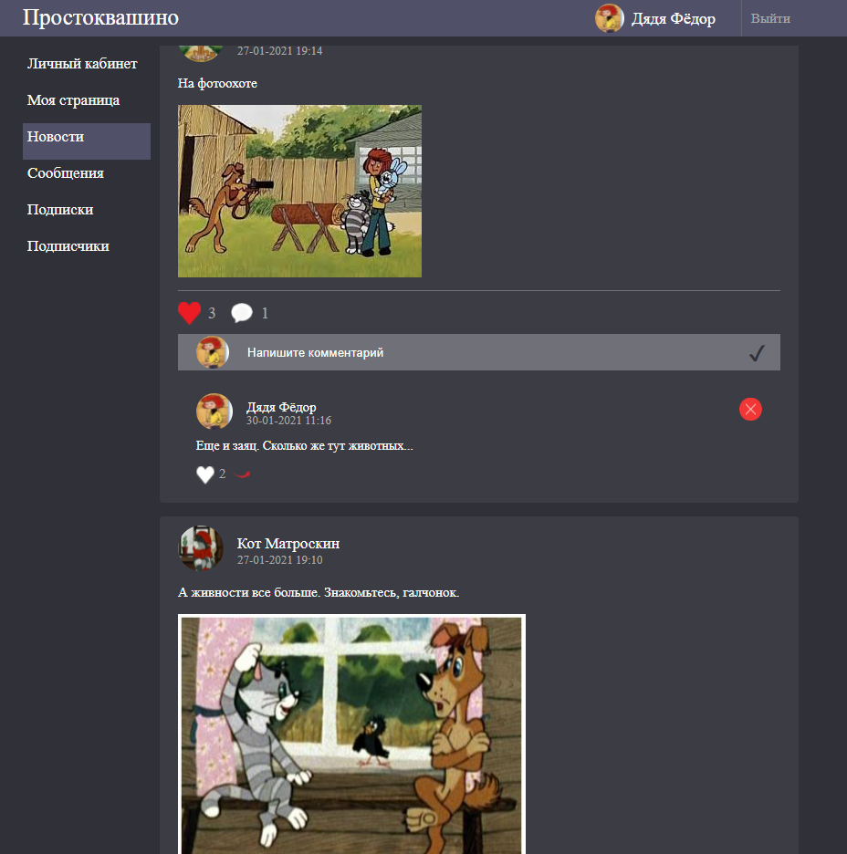

# Простоквашино
**Rest-application** Соцсеть  с мессенджером и подписками

Реализован функционал:

**Мессенджер с загрузкой фото**

**Личный кабинет**

**Просмотр профилей других пользователей**

**Подписки на других пользователей, возможность просматривать новости в ленте**

**Лайки и комментарии к постам, ответы к комментариям**

Проверить работу приложения можно зайдя, например, под данными:
login: ***fedor*** ; password: ***123***

##### Для запуска:
1) Создать БД prosto, указать логин и пароль к БД как
 ***spring.datasource.username*** и ***spring.datasource.password*** сответственно.
 Указать можно как в файле **application.properties**, так и в параметрах запуска приложения

2) Указать порт для запуска в **application.properties** (по умолчанию 8080)

3) Запустить **ProstoApplication.java**